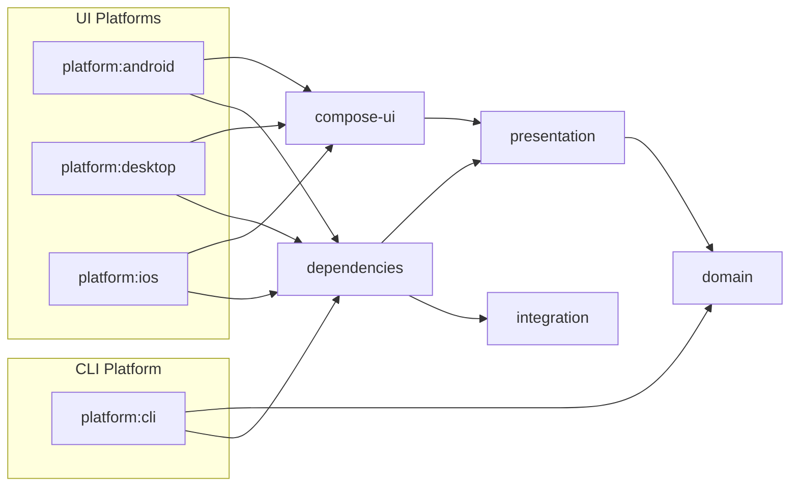

#  TodoList
**TodoList** is a cross-platform to-do list application built using **Kotlin Multiplatform**. It supports Android, iOS, Desktop (via Compose Multiplatform), and a powerful CLI (via Clikt).

## Features

- Create tasks with names, descriptions, and due dates (with time)
- Edit tasks — including their name, description, and due date
- Delete tasks when no longer needed
- Status transitions — Move tasks between Planned, In Progress, and Completed
- Time-based task categorization — Check which tasks are due or overdue
- Markdown support in descriptions:
  - Compose app: [mikepenz/multiplatform-markdown-renderer](https://github.com/mikepenz/multiplatform-markdown-renderer)
  - CLI: [ajalt/mordant](https://github.com/ajalt/mordant)
- Search & filter tasks by name, description, and status
- Supports English and German languages for all targets (Android, iOS, Desktop and CLI)

## Screenshots / Demo

### Mobile

Below are screenshots of all major screens available in the mobile version. The same UI components and logic are reused on the desktop version (see below).

| All Tasks                                               | Create Task                                               | Edit Task                                               |
|---------------------------------------------------------|-----------------------------------------------------------|---------------------------------------------------------|
|  |  |  |

| Important Tasks                                         | Task Details                                            | Settings                                               |
|---------------------------------------------------------|---------------------------------------------------------|--------------------------------------------------------|
|  |  |  |

### Desktop

To see the application in action on a desktop, check out this short video demo:

https://github.com/user-attachments/assets/e7fb61fc-1467-4035-aaa5-24ac7312089c

### CLI
The command-line interface offers a fast and scriptable way to manage tasks. It supports same features as Mobile or Desktop. Check the following video for more information:

https://github.com/user-attachments/assets/4b98d5e8-aee7-485f-920f-25b8dc86a016

## Running the App

You can find prebuilt executables for the following platforms in the [Releases](./releases) section:

- Android – APK included
- macOS – Desktop binary
- CLI – Native GraalVM binary

For other platforms:
- Clone the repo
- Make sure Kotlin Multiplatform and your platform SDKs are configured
- Run the appropriate target from the root `build.gradle.kts`

## Project structure
Here is brief description of each module (you may refer to the per-module README for more information).
```
todolist
├── domain             # Core domain logic (DDD-style, reused across all platforms)
├── presentation       # MVI layer for Compose UI
├── compose-ui         # Shared Compose UI module for Android, iOS, Desktop
├── integration        # Data implementations of domain repositories
├── dependencies       # Koin DI module to decouple and keep other modules clean
├── platform
│   ├── android        # Android entry point
│   ├── desktop        # Desktop entry point
│   ├── cli            # CLI entry point (Clikt + GraalVM)
│   └── ios            # iOS entry point (Xcode project for building KMP iOS app)
```
### Modules relations
The relations of the modules are the following:


## Dependencies

- [Clikt](https://github.com/ajalt/clikt) – CLI command parsing
- [Compose Multiplatform](https://github.com/JetBrains/compose-multiplatform) – UI for Android, Desktop, iOS
- [SQLDelight](https://github.com/cashapp/sqldelight) – Type-safe SQL database
- [Decompose](https://github.com/arkivanov/Decompose) – Navigation
- [Koin](https://insert-koin.io) – Dependency Injection
- [Kotlinx.serialization](https://github.com/Kotlin/kotlinx.serialization) – For settings & state retention
- [flowmvi](https://github.com/MichaelRocks/FlowMVI) – MVI architecture
- [GraalVM Native Image](https://www.graalvm.org/) – To compile CLI app to native binary

## License

This project is licensed under the [MIT License](https://opensource.org/licenses/MIT).
